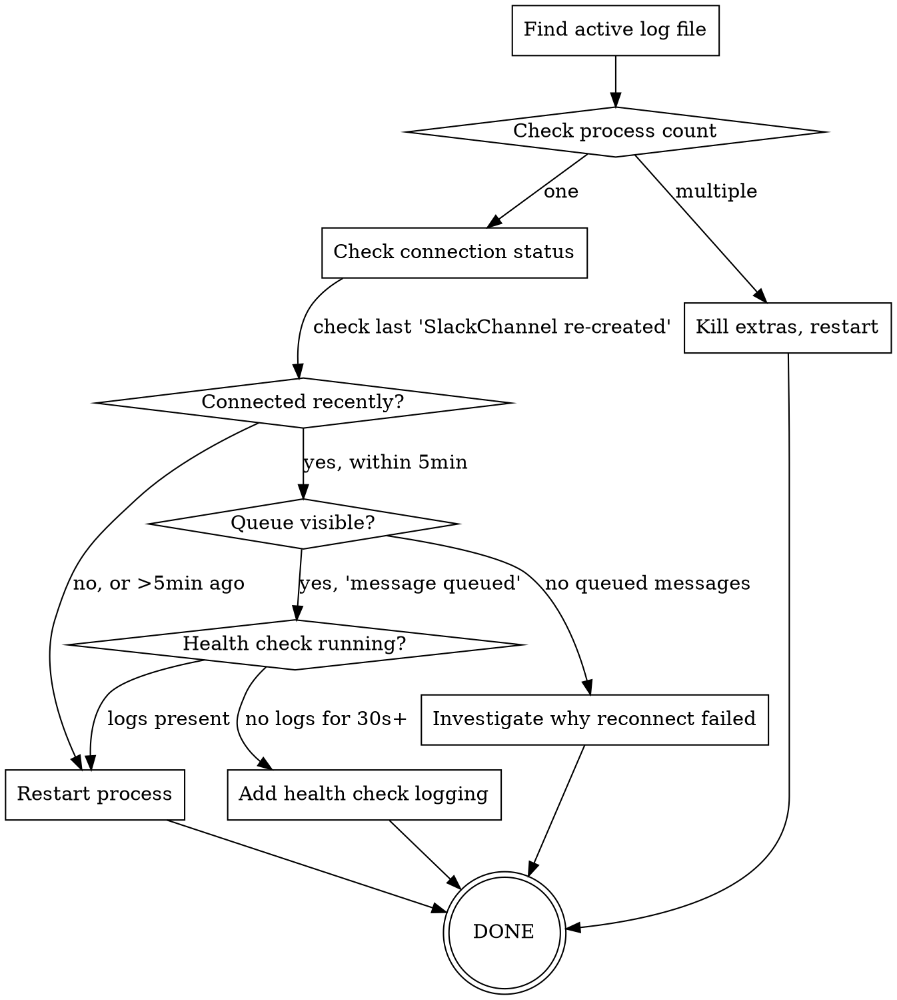

# Debugging NanoClaw Slack Connection Issues

## Overview

Systematic diagnosis of why NanoClaw responses aren't reaching Slack. The Slack connection has multiple failure modes (multiple processes, WebSocket death, health check failures) that produce similar symptoms but need different fixes.

## When to Use

**Symptoms:**
- Container completes successfully with agent output in logs
- No messages appear in Slack
- Logs show "Slack disconnected, message queued"
- Logs missing "Slack message sent" after container completion
- Messages were working previously but stopped

**Don't use for:**
- Container crashes or errors (use container debugging)
- No agent output generated (use OpenCode debugging)
- First-time setup (use nanoclaw setup skill)

## Diagnostic Workflow



## Step-by-Step Commands

### 1. Find Active Log File

NanoClaw logs to different files depending on how it started:

```bash
# Check which log file is most recent
ls -lth logs/*.log | head -3

# Active log is the one modified most recently
# Usually nanoclaw-opencode.log for launchd/systemd
# May be nanoclaw.log for manual runs
```

**Key point:** Don't assume `nanoclaw.log` is active. Check timestamps.

### 2. Check Process Count

```bash
# Count running processes
ps aux | grep -E "bun.*nanoclaw.*index\.ts" | grep -v grep

# Should see exactly ONE process
# Multiple processes = root cause found
```

**If multiple processes:** Kill all but the launchd-managed one, or restart service:

```bash
# macOS
launchctl kickstart -k gui/$(id -u)/com.nanoclaw-opencode

# Linux
systemctl --user restart nanoclaw
```

### 3. Check Connection Status

```bash
# Find last reconnection in active log
grep "SlackChannel re-created" logs/nanoclaw-opencode.log | tail -1

# Find recent queue events
grep "message queued" logs/nanoclaw-opencode.log | tail -5

# Check health check activity (should run every 30s)
grep -E "WebSocket is not active|Network" logs/nanoclaw-opencode.log | tail -10
```

**Interpret results:**

| Last reconnection | Queue events | Health check logs | Diagnosis |
|-------------------|--------------|-------------------|-----------|
| >5 min ago | Present | None recent | Health check died, restart needed |
| <5 min ago | Present | None recent | Health check not starting after reconnect |
| >30 min ago | None | Present, trying | Reconnection failing repeatedly |
| Recent | None | None | Connection actually fine, check IPC |

### 4. Check for Queued Messages

```bash
# Look for queueSize in recent logs
grep "queueSize" logs/nanoclaw-opencode.log | tail -10
```

**If queueSize increasing:** Messages are being queued, not sent. Restart will flush.

**If no queueSize logs but messages missing:** Problem is earlier in chain (IPC, container).

### 5. Verify Process Identity

```bash
# Get PID of running process
ps aux | grep "bun.*nanoclaw.*index\.ts" | grep -v grep | awk '{print $2}'

# Check if that PID appears in recent logs
tail -50 logs/nanoclaw-opencode.log | grep "PID_HERE"
```

**If PID not in recent logs:** Process is older than log rotation, definitely restart needed.

## Common Root Causes

### Multiple Processes

**Symptom:** Each process fights for Slack WebSocket connection, constantly disconnecting each other.

**Evidence:**
- Different PIDs in logs around same timestamp
- "SlackChannel re-created" from one PID, "message queued" from another
- Process count > 1

**Fix:** Kill duplicates, add PID file locking (long-term fix).

### Health Check Stopped After Reconnection

**Symptom:** Reconnection succeeds but future disconnections aren't detected.

**Evidence:**
- "SlackChannel re-created and connected" followed by no health check logs
- No "WebSocket is not active" logs for >1 minute
- `this.connected` somehow false despite successful reconnection

**Fix:** Restart process. Investigate why `startHealthCheck()` isn't being called or timer is being cleared.

### Slack Kicking Old Connection

**Symptom:** When new process connects, old process doesn't detect WebSocket death.

**Evidence:**
- One PID shows reconnection
- Different PID shows "message queued" shortly after
- Health check from kicked process shows no activity

**Fix:** Ensure only one process running.

## Immediate Fix (Works for All Cases)

```bash
# macOS
launchctl kickstart -k gui/$(id -u)/com.nanoclaw-opencode

# Linux  
systemctl --user restart nanoclaw

# Wait 10 seconds for clean startup
sleep 10

# Verify single process running
ps aux | grep "bun.*nanoclaw.*index\.ts" | grep -v grep

# Tail logs to confirm connection
tail -f logs/nanoclaw-opencode.log
# Should see: "Connected to Slack" within 30 seconds
# Should see: "Handing off queued messages" if messages were queued
```

## Common Mistakes

### ❌ Assuming `nanoclaw.log` is Active

**Problem:** Logs might be in `nanoclaw-opencode.log` instead.

**Fix:** Always check `ls -lth logs/*.log` first.

### ❌ Trusting "Connected to Slack" Means Working

**Problem:** Process can show connected but be stuck disconnected.

**Evidence:** Look for "Slack message sent" after container completion, not just "Connected to Slack" at startup.

### ❌ Assuming Health Check is Running

**Problem:** Health check might not start after reconnection, or might be cleared by another code path.

**Evidence:** No health check logs (WebSocket/network messages) for >1 minute means it's not running.

### ❌ Not Checking Process Count

**Problem:** Multiple processes competing explains many weird symptoms.

**Fix:** ALWAYS verify single process before investigating other causes.

### ❌ Searching All Logs for Context

**Problem:** Going through entire log history wastes time and adds confusion from old processes.

**Fix:** Focus on logs from current process PID and last 30 minutes only.

## Adding Diagnostic Logging

If immediate fix works but problem recurs, add logging to understand why:

**Option 1: Health check activity**

Edit `src/channels/slack.ts` line 359 (inside `startHealthCheck`):

```typescript
this.healthCheckTimer = setInterval(async () => {
  const ws = this.getWebSocket();
  logger.debug({ active: ws?.isActive(), reconnecting: this.reconnecting }, 'Health check tick'); // ADD THIS
  if (!ws || ws.isActive() || this.reconnecting || waitingForNetwork) return;
  // ... rest of health check
```

**Option 2: Connection state changes**

Edit `src/channels/slack.ts` line 272 and 374:

```typescript
this.connected = true;
logger.info('SlackChannel.connected set to TRUE'); // ADD THIS

// and

this.connected = false;  
logger.info('SlackChannel.connected set to FALSE', new Error().stack); // ADD THIS (includes stack trace)
```

**After adding logging:** Restart process, reproduce issue, share logs with maintainer.

## Long-Term Fixes Needed

Based on this debugging session, NanoClaw needs:

1. **PID file locking** - Prevent multiple processes from starting
2. **Health check verification** - Log every 30s that check ran, even if connection healthy  
3. **Connection state machine logging** - Trace every transition of `this.connected`
4. **WebSocket death detection improvement** - Don't rely solely on `isActive()`, also check for send failures

These are code changes, not operational fixes.
